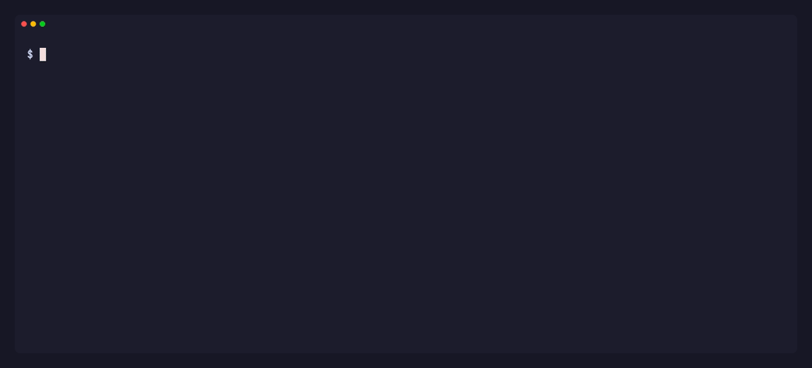
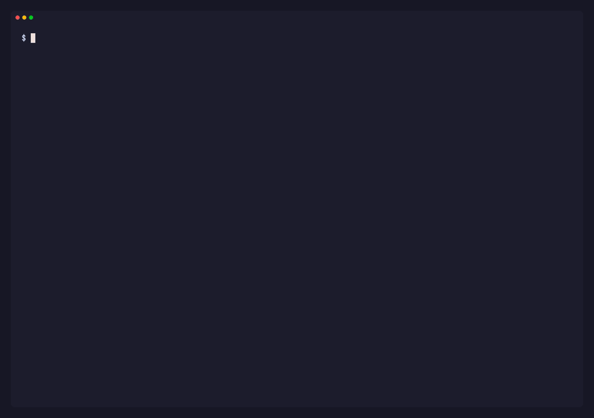

# Demo review — v0.4.0-beta

Throwaway branch, just so the four re-recorded GIFs render on one page. **Not part
of [PR #32](https://github.com/paramify/paramify-fetchers/pull/32)** — delete the
branch when you're done.

All four are recorded against the demo program (`manifests/demo.yaml`, the `demo`
category): no credentials, no network, no cloud account. Anyone can re-record them
and get the same run.

> **Second pass.** The first cut looked flat because the CLI emitted **zero** ANSI —
> `paramify catalog` in your own Ghostty was equally grey, and the only color was the
> ✅/❌ emoji glyphs. So the CLI now paints (`framework/cli_style.py`), and the tapes
> match Ghostty: Catppuccin Mocha, JetBrainsMono Nerd Font, macOS window chrome.
>
> Colors are the terminal's own 16, never hex — the TUI can hardcode Tokyo Night
> because it paints its own surface, but a CLI writes onto someone else's. So this
> output looks right in Catppuccin, Solarized, or a light theme, and the recording
> just inherits whatever theme it's rendered in.

---

## 1. `firstrun.gif` — the zero-credential first run

**New.** There was no visual for this before; the README described it in a
blockquote. Sits under *The TUI → Try it before you wire anything up*.

- 18.8s · 339 KB · [`docs/demo/firstrun.tape`](docs/demo/firstrun.tape)
- **What to check:** nine invocations with `[OK]` green and one `[FAIL]` red, fetcher
  names in mauve, timings receding into dim. Then the final frame: `paramify evidence`
  with **highlighted JSON**, landing on `status: failed` / `error` /
  `error_code: not_authorized`.
- That last frame is why `FORCE_COLOR` exists in the tape — the command is piped into
  `head`, and click strips ANSI on a pipe by design.

---

## 2. `doctor.gif` — build a manifest, then preflight it

**Replaces `manifest.gif`.** The old one stopped at "still missing", because the
Okta secrets it wired can never be satisfied on camera. This one closes the loop.
Sits under *Building a manifest*.

- 33.6s · 409 KB · [`docs/demo/doctor.tape`](docs/demo/doctor.tape)
- **What to check:** the "not yet runnable" warnings in yellow appearing and clearing;
  then `doctor` with a red `missing:` and a cyan `DEMO_API_TOKEN`, one `export`, and a
  green **All good.**
- Longest of the four. The two `add-target` lines are the most cuttable if it drags.

---

## 3. `catalog.gif` — the catalog, then two contracts

**Re-recorded.** The old one claimed 8 categories / 107 fetchers. Sits under
*Using the CLI*.

- 19.5s · 565 KB · [`docs/demo/catalog.tape`](docs/demo/catalog.tape)
- **What to check:** frame 1 is plain `paramify catalog` (no grep pipeline this time)
  — category names now bold mauve, descriptions dim, `platform config:` keys cyan, so
  the structure is scannable instead of a wall. Then `describe demo_audit_logging`,
  then `describe aws_iam_roles`.
- That last frame is the densest thing in the set: the optional ambient credentials,
  and the per-field `env=` and descriptions that `describe` never used to print at all
  (both schemas claimed it did).

---

## 4. `tui.gif` — the whole loop

**Re-recorded, and the reason all of this needed doing.** The old one was rendered
9 July: one day before the TUI's design language changed, two weeks before the
Paramify tab was rebuilt. It showed an app that no longer exists, visited 3 of 5
tabs, and never ran anything.

- 39.2s · 2.8 MB · [`docs/demo/tui.tape`](docs/demo/tui.tape)
- Keeps TokyoNight, since the app paints that surface itself — only the font and the
  window chrome changed here.
- **What to check, in order:**
  1. welcome screen settling on **one** manifest — `demo.yaml · 5 · ✓ runnable · never run`
  2. Catalog with `/demo` search
  3. Manifest tab, cursor walking down to `demo_access_review` — `secrets 1/2`, because the second one is optional
  4. Run tab, `ctrl+r`: pills going QUEUED → RUNNING → OK, and `demo_audit_logging` landing on **PARTIAL 2/3 ok** with a red ✗ in the log
  5. Evidence tab, opening the failed target — the modal shows the reported reason
  6. Paramify tab — honestly showing `API token missing`, since the recording has none
- 2.8 MB is the one heavy asset, and framerate is already at its sweet spot (12fps
  saved nothing, 20fps cost 200 KB). Trimming length is the only lever left; the
  catalog-search segment is what I'd cut first.

---

## Also worth a look while you're here

**The color, which is a change to the tool and not just the recordings:**

- [`framework/cli_style.py`](framework/cli_style.py) — the roles, and why they're ANSI
  names rather than hex. They mirror `framework/tui/palette.py` so both front-ends say
  pass/warn/fail the same way.
- [`tests/test_cli_color.py`](tests/test_cli_color.py) — pins the three answers that
  matter: piped output has no escapes, `--json` is never colored under any setting, and
  `NO_COLOR` / `FORCE_COLOR` override in each direction.

**The recording harness**, which is why these are reproducible and why your live
tenant names stay out of a public README:

- [`docs/demo/render.sh`](docs/demo/render.sh) — records inside a throwaway git
  worktree at `/tmp/paramify-demo`. A worktree holds only tracked files, so the camera
  sees a fresh clone instead of your `manifests/azure.yaml`, `gcp.yaml` and 10+ real
  Azure/GCP evidence runs. It now refuses to start if that worktree already exists: I
  had two renders running at once, the first one's cleanup deleted the worktree under
  the second, and `doctor.gif` recorded a `FileNotFoundError` traceback instead of the
  demo.
- [`docs/demo/README.md`](docs/demo/README.md) — what each tape shows, how to
  re-render, and when re-recording is due.
- [`fetchers/demo/README.md`](fetchers/demo/README.md) — the five fetchers, and the
  distinction `demo_audit_logging` exists to teach: "we could not look" is not the same
  as "we looked, and it is off".

## In context

The README with the GIFs in their real places:
[README.md on `release/v0.4.0-beta`](https://github.com/paramify/paramify-fetchers/blob/release/v0.4.0-beta/README.md)
